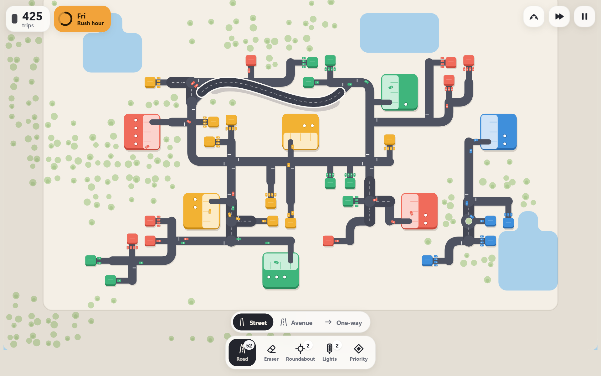
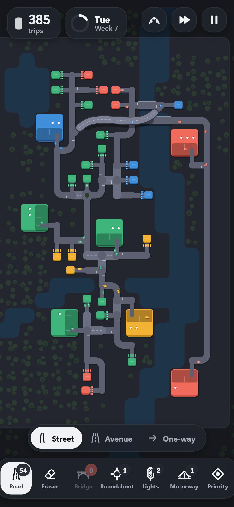

# Trafic

A minimalist traffic management game for the browser, inspired by *Mini Motorways* and *Cities: Skylines + TM:PE*.
Draw roads to link every house to the building of its colour, then keep the city flowing as it grows.

**[▶ Play in your browser](https://clementbrls.github.io/trafic/)**

<p align="center">
  <picture>
    <source media="(prefers-color-scheme: dark)" srcset="docs/screenshot-dark.png">
    
  </picture>
</p>

The game runs **entirely client-side** (no server): desktop, tablet and phone, in portrait or landscape. Once added to the home screen, it works offline.

## How it plays



- Every **house** owns four cars. **Buildings** ask for trips (white dots) that cars of their colour come to fulfil: each delivery scores 1 point.
- Houses grow in **districts**, away from their building and further out as the city expands: flows of different colours cross each other, so you need real arterial roads.
- A new building starts asking as soon as a house can reach it (or after a few seconds).
- When a building piles up too many requests, a countdown starts. If it runs out, the game is over.
- Every **week**, the map grows, you receive roads and you pick an upgrade.
- Built for phones first: every tool is a drag or a tap, and the portrait layout fits a 375 px wide screen.

<br clear="right">

### Traffic mechanics

| Element | Effect |
| --- | --- |
| **Street** | Standard road, 1 road per tile. |
| **Avenue** (week 2) | Faster and has **priority**: at junctions, streets give way to it. Costs 2 roads per tile. |
| **One-way** (week 2) | Follows the direction of your drag, with arrows on the road. Removes conflicts at junctions. |
| **Junction** | A through road (2 arms of the highest class) has priority; where 3 or more equal roads meet, the junction works as an **all-way stop**. |
| **Roundabout** | Several cars move at once; entering cars give way to the ring. |
| **Traffic lights** | Alternating phases that adapt to demand. |
| **Motorway** | A fast lane flying over everything, in any direction (up to 13 tiles). Its ramps follow the grid and the deck curves smoothly between them. |
| **Bridge** | Placed automatically when you draw across water. |
| **Priority** (week 3) | Tap a junction to cycle: automatic priority → chosen priority road (the others must stop) → no left turns. |
| **Traffic view** | Colours roads by congestion (green → red). |
| **Rush hour** | Demand follows a weekly rhythm: busy end of week, quiet weekend. |

Drawing over an existing road with another type converts it (a street becomes an avenue, a one-way road becomes two-way again…).

A building **overflows when its customers wait too long**: each request (white dot) turns orange, then red after 30 s; from 3 late requests on, the countdown starts. White lines on the road show which arms must stop.

### Which tool for which jam?

Measured in a 4-arm test junction (trips per minute, heavy traffic):

| Situation | Stop | Priority (free) | Avenue | Lights | Roundabout |
| --- | --- | --- | --- | --- | --- |
| Two major roads crossing straight | 59 | 68 | 71 | **95** | 92 |
| Lots of turning cars | 58 | 61 | 66 | 76 | **89** |
| Medium traffic | 53 | 60 | 62 | 68 | 67 |
| Light traffic | 25 | 26 | 28 | 27 | 27 |

- **Stop**: good enough while traffic is light.
- **Priority / avenue**: useful when one road dominates, but the side road can end up stuck.
- **Lights**: ideal where two major roads cross, even better with left turns banned.
- **Roundabout**: the best choice as soon as many cars turn.
- **No left turns**: a small gain (a few %) at lights, when a detour exists.
- **Avenues and motorways** pay off on long trips: on a 17-tile route, a trip takes 13.6 s on streets, 11.5 s on avenues and 11.1 s with a motorway, which also flies over the busy junctions.

Demand comes from the houses: each one asks for trips to the nearest building of its colour, more and more often. The shorter and smoother the round trips, the longer the city lasts. Test bots survive about 15 weeks on Plains and River, and about 12 on Archipelago.

### Controls

- **Mouse**: left click to draw, right click to erase, wheel to zoom, middle click (or Shift + drag) to pan.
- **Touch**: one finger to draw, two fingers to pan / zoom, eraser tool to erase.
- **Keyboard**: `Space` pause · `1`–`6` tools · `T` road type · `V` traffic view · `F` speed · `C` recenter · `Esc` menu.

The interface is available in English and French.

## Run it locally

```bash
npm install
npm run dev
```

Open the address shown (`http://localhost:5173`). To try it on your phone, connect it to the same Wi-Fi and open the "Network" address printed by Vite (the server already listens on the local network).

## Scripts

| Command | Purpose |
| --- | --- |
| `npm run dev` | Development server (reachable on the local network). |
| `npm run build` | TypeScript check + production build into `dist/`. |
| `npm run preview` | Serves the production build. |
| `npm test` | Tests (road network, routing, simulation, junctions). |
| `BALANCE=1 npx vitest run tests/balance.test.ts` | Balance probes (bots play whole games). |

`dist/` is a static site: it can be deployed as is to GitHub Pages, Netlify, itch.io, etc. (all paths are relative). This repository deploys to GitHub Pages on every push to `main`.

## Architecture

```
src/
  core/        maths, PRNG, polylines, binary heap
  game/
    network.ts    road graph (nodes on the grid, 8-direction links, bridges, free-angle motorways)
    geometry.ts   lane paths (curves, roundabouts, conflict zones)
    pathfind.ts   A* over (node, arrival arm): one-way roads, turn bans
    traffic.ts    cars, queues, junctions (tickets, priorities, stops, lights, roundabouts), parking lots
    game.ts       spawning (buildings, districts, houses), demand, weeks, upgrades, inventory
    builder.ts    building tools (drawing, eraser, road types, stroke undo)
    autobuild.ts  small builder bot (menu demo city, tests)
  render/      Canvas 2D rendering (terrain, roads, buildings, cars, effects), camera
  ui/          DOM HUD and menus
  audio.ts     sound effects and generative music (WebAudio, no audio files)
  input.ts     mouse / touch / pinch
```

The simulation runs at a fixed step (60 Hz). Each car follows a list of segments; cars sharing a segment share a lane. At junctions, a car needs a "ticket": it is granted when no conflicting movement is in progress, when the exit has room (no car is ever left blocking the middle of a junction) and according to priorities (through road, stop, lights, roundabout ring).
